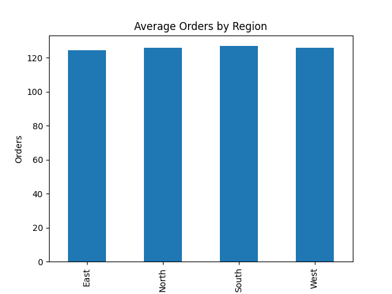
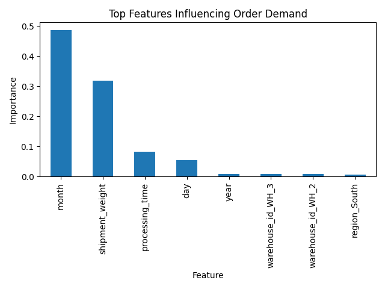

# Predictive Analytics System for Supply Chain Demand Forecasting

##  Overview
This project is an end-to-end predictive analytics system built to forecast daily order demand in a supply chain environment.  
It simulates a real-world logistics use case where historical shipment, operational, and regional data are used to predict future demand.

The project demonstrates the complete data science workflow, including data generation, exploratory data analysis (EDA), machine learning modeling, evaluation, and explainability.

---

##  Problem Statement
Accurate demand forecasting is critical for logistics and supply chain companies to:
- Plan warehouse infrastructure
- Allocate workforce efficiently
- Reduce operational delays
- Improve overall supply chain performance

This project aims to predict "daily order volumes" using historical data while ensuring realistic modeling by avoiding feature leakage.

---

##  Tech Used
- **Programming Language:** Python  
- **Libraries:** Pandas, NumPy, Matplotlib, Scikit-learn  
- **Machine Learning Models:** Linear Regression, Random Forest Regressor  
- **Development Environment:** VS Code  

---

##  Project Structure
├── generate_data.py # Synthetic logistics data generation
├── eda.py # (EDA)
├── ml_model.py # Machine Learning models and evaluation
├── logistics_data.csv # Dataset
├── average_orders_by_region.png # EDA visualization
├── feature_importance.png # Feature importance visualization
├── Problem Statement.txt

---

##  Exploratory Data Analysis (EDA)
- Analyzed order distribution across regions
- Studied trends over time
- Verified data quality and feature distributions
- Visualized average demand by region

 "Average Orders by Region"

---

##  Machine Learning Approach

### Models Used
1. **Linear Regression** – used as a baseline model  
2. **Random Forest Regressor** – used as an advanced non-linear model  

### Key Steps
- Feature engineering from date (day, month, year)
- One-hot encoding of categorical variables (region, warehouse)
- Removal of **feature leakage** (workers variable)
- Train-test split (80% training, 20% testing)
- Model evaluation using MAE and RMSE

---

##  Model Performance

| Model | MAE | RMSE |
|------|-----|------|
| Linear Regression | ~13.8 | ~17.1 |
| Random Forest Regressor | ~12.6 | ~15.7 |

 Random Forest performed better and was selected as the final model.

---

##  Feature Importance
Feature importance from the Random Forest model was used to explain which factors most influence order demand.

"Top influencing features:"
- Month (seasonality)
- Shipment weight
- Processing time
- Day of the month
- Region and warehouse identifiers

 **Feature Importance Visualization**

---

##  Key Learnings , what i've learned
- Built a complete end-to-end machine learning pipeline
- Gained hands-on experience with EDA and feature engineering
- Identified and resolved feature leakage to improve model realism
- Compared baseline and advanced ML models
- Applied explainable AI techniques using feature importance
- Translated technical results into business insights

---

##  How to Run the Project

1. Clone the repository:
git clone https://github.com/garvupadhyay2004/predictive-analytics-supply-chain.git

2. Install required dependencies:
pip install pandas numpy matplotlib scikit-learn

3. Run the project scripts in order:--
python generate_data.py-->
python eda.py-->
python ml_model.py

##  Author
Gaurav Upadhyay  
B.Tech CSE (Data Science)

GitHub: https://github.com/garvupadhyay2004
